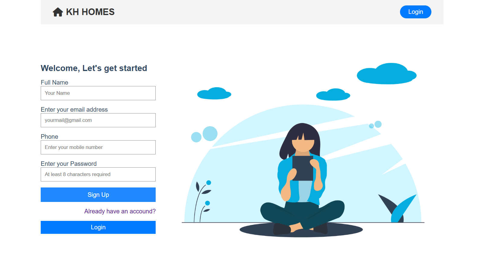
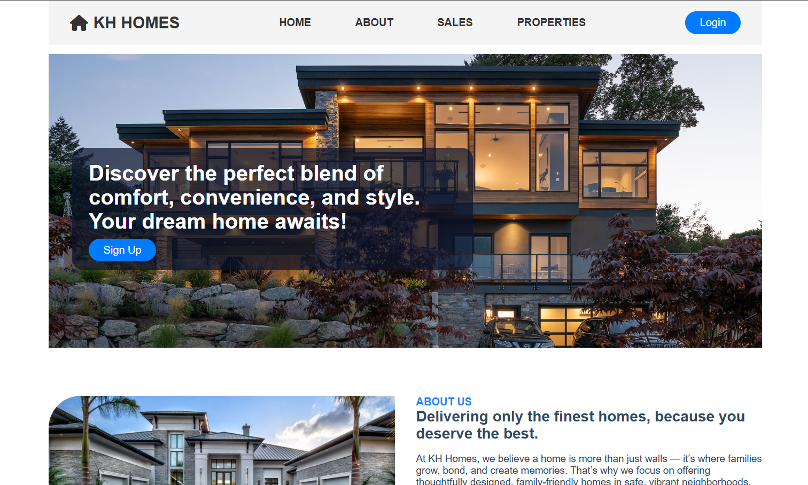
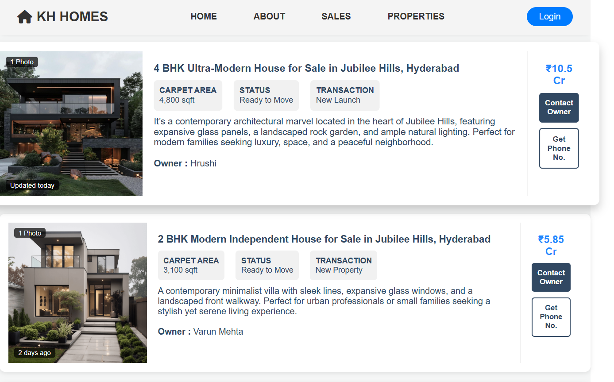

# KH Homes – Modern Real Estate Web Interface

KH Homes is a visually engaging, front-end real estate website designed to showcase premium housing listings with clarity, convenience, and style. This project demonstrates a strong understanding of responsive design, layout structuring, and user-centric web presentation.

---

##  Features

-  Visually appealing property cards with details like BHK, price, area, and availability  
-  Clean navigation bar with links to Home, About, Sales, and Properties  
-  Fully responsive layout  
-  Highlighted featured properties section  
-  User interaction buttons (Login, Contact Owner, Get Phone No.)  
-  Modern font and icon integrations using FontAwesome & Boxicons

---

##  Tech Stack

- **HTML5** – Markup structure  
- **CSS3** – Styling and responsiveness  
- **Font Awesome & Boxicons** – Icons and visual cues  

---

##  Preview

Here are some preview images of the website:

  
  

---

## Project Purpose

The purpose of this project is to design a modern and responsive real estate website that offers a seamless and engaging user experience. It focuses on clean UI design, intuitive navigation, and showcasing property details in a visually appealing way. This project highlights essential front-end development skills through a practical and real-world example.

---

##  Future Enhancements

- Backend integration for dynamic listings  
- Search & filter functionality  
- Login/Register system  
- Interactive map view for properties

---
